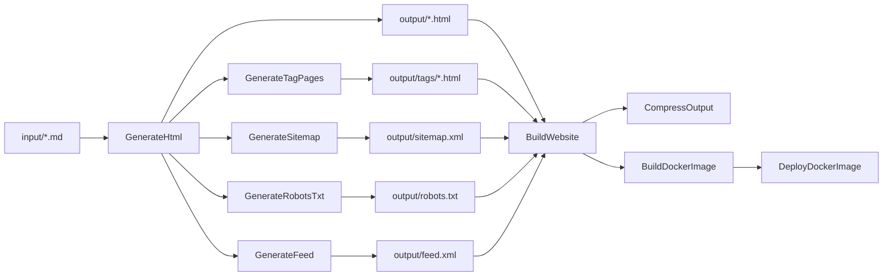
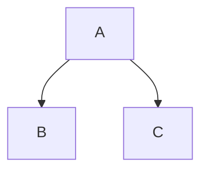

# StaticWGen

[](https://github.com/phmatray/StaticWGen/actions/workflows/ci.yml)
[](https://dotnet.microsoft.com/)
[](LICENSE)

A static website generator powered by [NUKE](https://nuke.build/), [Markdig](https://github.com/xoofx/markdig), and [Pico CSS](https://picocss.com/). Write content in Markdown with YAML front-matter, and StaticWGen generates a complete static website with SEO metadata, syntax highlighting, diagrams, feeds, and more.

## Features

- **Markdown to HTML** — Convert `.md` files to styled HTML pages using Markdig
- **YAML Front-Matter** — Define page metadata (title, description, author, date, keywords, image)
- **Prism.js Syntax Highlighting** — Automatic code block highlighting for 200+ languages
- **Mermaid Diagrams** — Embed flowcharts, sequence diagrams, and more using fenced code blocks
- **Emoji Support** — Use `:emoji:` shortcodes in your content
- **LaTeX Mathematics** — Inline `\( ... \)` and display `\[ ... \]` math expressions
- **SEO Generation** — Open Graph, Twitter Cards, sitemap.xml, robots.txt
- **Atom Feed** — Automatic `feed.xml` generation for blog content
- **Tagging System** — Tag index and per-tag pages from `keywords` metadata
- **Theme Switching** — Built-in light/dark/auto theme toggle
- **Docker Deployment** — One-command deployment with nginx
- **CI/CD** — GitHub Actions workflows for build, release, and GitHub Pages deployment

## Architecture



## Quick Start

### Prerequisites

- [.NET 10 SDK](https://dotnet.microsoft.com/download) (or later)

### 1. Clone and configure

```bash
git clone https://github.com/phmatray/StaticWGen.git
cd StaticWGen
```

### 2. Build the website

```bash
./build.sh BuildWebsite \
  --site-base-url "http://localhost:8080" \
  --site-title "My Site"
```

The generated site is in the `output/` directory.

### 3. Serve locally

```bash
cd output && python3 -m http.server 8080
```

Open http://localhost:8080 in your browser.

### 4. Deploy with Docker (optional)

```bash
./build.sh DeployDockerImage \
  --site-base-url "http://localhost:8080" \
  --site-title "My Site" \
  --image-name my-site \
  --version-tag latest \
  --container-name my-site \
  --host-port 8080 \
  --container-port 80
```

## Configuration Reference

All parameters can be set via command-line flags or in `.nuke/parameters.json`:

| Parameter | Required | Description | Example |
|-----------|----------|-------------|---------|
| `SiteTitle` | Yes | Title displayed in header, footer, and meta tags | `"My Blog"` |
| `SiteBaseUrl` | Yes | Base URL for absolute links, sitemap, and feed | `"https://example.com"` |
| `DefaultImageUrl` | No | Fallback Open Graph image URL | `"./assets/logo.webp"` |
| `FeedTitle` | No | Atom feed title (defaults to `SiteTitle`) | `"My Blog Feed"` |
| `FeedDescription` | No | Atom feed description | `"Latest posts"` |
| `FeedAuthor` | No | Default author for feed entries | `"Jane Doe"` |
| `ImageName` | Docker | Docker image name | `"my-site"` |
| `VersionTag` | Docker | Docker image version tag | `"latest"` |
| `ContainerName` | Docker | Docker container name | `"my-site"` |
| `HostPort` | Docker | Host port for Docker container | `8080` |
| `ContainerPort` | Docker | Container port (typically 80) | `80` |

Example `.nuke/parameters.json`:

```json
{
  "$schema": "build.schema.json",
  "SiteTitle": "My Static Website",
  "SiteBaseUrl": "http://localhost:8080",
  "ImageName": "my-static-website",
  "VersionTag": "latest",
  "ContainerName": "my-static-website",
  "HostPort": 8080,
  "ContainerPort": 80
}
```

## Content Authoring Guide

### Creating pages

Add Markdown files to the `input/` directory. Each `.md` file becomes an HTML page.

### YAML front-matter

Add metadata at the top of your Markdown files:

```markdown
---
title: "My Page Title"
description: "A brief description for SEO and social sharing"
author: "Your Name"
date: "2024-09-13"
keywords: "tag1, tag2, tag3"
image: "./assets/my-image.webp"
---

# Your Content Here
```

### Supported metadata fields

| Field | Purpose | Used in |
|-------|---------|---------|
| `title` | Page title | `<title>`, Open Graph, Twitter Card |
| `description` | Page description | `<meta>`, Open Graph, Twitter Card, feed |
| `author` | Author name | `<meta>`, feed entries |
| `date` | Publication date | Feed entries, tag pages |
| `keywords` | Comma-separated tags | Tag pages, `<meta>` keywords |
| `image` | Social sharing image URL | Open Graph, Twitter Card |

### Markdown extensions

**Emoji** — Use shortcodes like `:smile:`, `:rocket:`, `:wave:`

**Mathematics** — Inline: `\( E = mc^2 \)`, Display: `\[ x = \frac{-b \pm \sqrt{b^2-4ac}}{2a} \]`

**Code blocks** — Use fenced code blocks with a language identifier:

````markdown
```csharp
Console.WriteLine("Hello!");
```
````

**Mermaid diagrams** — Use `mermaid` as the language:

````markdown

````

### Static assets

Place images and other assets in `input/assets/`. They are copied to `output/assets/` during build.

## Build Targets Reference

| Target | Depends On | Description |
|--------|-----------|-------------|
| `Clean` | — | Deletes the output directory |
| `GenerateHtml` | Clean | Converts Markdown files to HTML using the template |
| `GenerateTagPages` | GenerateHtml | Generates tag index and individual tag pages |
| `GenerateSitemap` | GenerateHtml | Generates `sitemap.xml` from all HTML files |
| `GenerateRobotsTxt` | GenerateHtml | Generates `robots.txt` |
| `GenerateFeed` | GenerateHtml | Generates Atom `feed.xml` from dated content |
| `CopyAssets` | Clean | Copies `input/assets/` to `output/assets/` |
| `CopyJsScripts` | Clean | Copies `template/js/` to `output/js/` |
| `CopyCss` | Clean | Copies `template/css/` to `output/css/` |
| `BuildWebsite` | All above | Orchestrates the full site generation |
| `CompressOutput` | BuildWebsite | Creates `site.zip` from the output directory |
| `BuildDockerImage` | BuildWebsite | Builds an nginx Docker image with the site |
| `DeployDockerImage` | BuildDockerImage | Runs the Docker container locally |

Run any target with:

```bash
./build.sh <TargetName> --site-base-url "..." --site-title "..."
```

## Template Customization

The HTML template is at `template/template.html` and uses [Scriban](https://github.com/scriban/scriban) syntax.

### Available template variables

| Variable | Type | Description |
|----------|------|-------------|
| `{{ site_title }}` | string | Site title from configuration |
| `{{ page_title }}` | string | Page title from front-matter or filename |
| `{{ description }}` | string | Page description |
| `{{ keywords }}` | string | Page keywords |
| `{{ author }}` | string | Page author |
| `{{ date }}` | string | Publication date |
| `{{ content }}` | string | Rendered HTML content |
| `{{ page_url }}` | string | Absolute URL of the page |
| `{{ image_url }}` | string | Social sharing image URL |
| `{{ menu }}` | list | Navigation menu items (`.title`, `.url`) |
| `{{ tags }}` | list | Page tags (`.name`, `.url`) |

### Template structure

- `template/template.html` — Main HTML template
- `template/js/` — JavaScript files (theme switcher, Prism.js, modal)
- `template/css/` — CSS files (Prism.js theme)

## Docker Deployment

StaticWGen uses a lightweight nginx Alpine image to serve the generated static files.

```bash
# Build and deploy in one step
./build.sh DeployDockerImage \
  --site-base-url "https://example.com" \
  --site-title "My Site" \
  --image-name my-site \
  --version-tag 1.0.0 \
  --container-name my-site \
  --host-port 8080 \
  --container-port 80
```

Or build the Docker image manually:

```bash
# Generate the site first
./build.sh BuildWebsite --site-base-url "https://example.com" --site-title "My Site"

# Build and run
docker build -t my-site .
docker run -d -p 8080:80 --name my-site my-site
```

## Contributing

1. Fork the repository
2. Create a feature branch from `dev`
3. Make your changes
4. Ensure the build passes: `./build.sh BuildWebsite --site-base-url "http://localhost:8080" --site-title "Test"`
5. Submit a pull request to `dev`

### Project structure

```
StaticWGen/
├── build/              # NUKE build targets (C# interfaces)
│   ├── Build.cs        # Main build class
│   ├── IClean.cs       # Clean target
│   ├── IGenerateWebsite.cs  # HTML generation
│   ├── IGenerateFeed.cs     # Atom feed generation
│   ├── IGenerateTagPages.cs # Tag page generation
│   ├── ISitemap.cs     # Sitemap generation
│   ├── IRobotsTxt.cs   # robots.txt generation
│   └── ...
├── input/              # Markdown source files
│   ├── assets/         # Static assets (images, etc.)
│   └── *.md            # Content pages
├── template/           # HTML template and assets
│   ├── template.html   # Scriban template
│   ├── js/             # JavaScript files
│   └── css/            # CSS files
├── output/             # Generated site (git-ignored)
├── .github/workflows/  # CI/CD pipelines
├── Dockerfile          # nginx deployment
└── build.sh            # Build entry point
```

## License

This project is licensed under the MIT License — see the [LICENSE](LICENSE) file for details.
