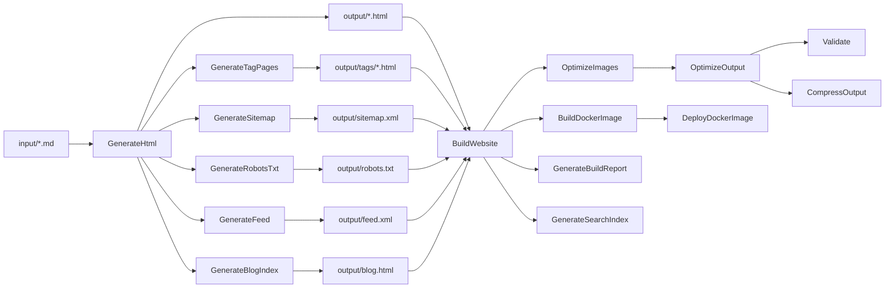
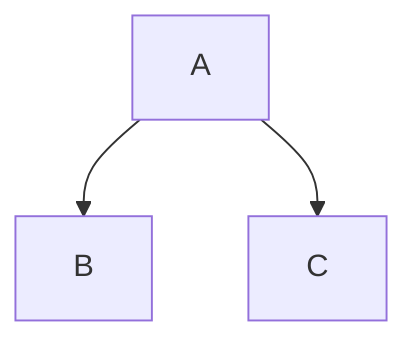

# StaticWGen

[](https://github.com/Atypical-Consulting/StaticWGen/actions/workflows/ci.yml)
[](https://dotnet.microsoft.com/)
[](LICENSE)

A static website generator powered by [NUKE](https://nuke.build/), [Markdig](https://github.com/xoofx/markdig), and [Pico CSS](https://picocss.com/). Write content in Markdown with YAML front-matter, and StaticWGen generates a complete static website with SEO metadata, syntax highlighting, diagrams, feeds, and more.

## Features

- **Markdown to HTML** — Convert `.md` files to styled HTML pages using Markdig
- **YAML Front-Matter** — Define page metadata (title, description, author, date, keywords, image)
- **Prism.js Syntax Highlighting** — Automatic code block highlighting for 200+ languages
- **Mermaid Diagrams** — Embed flowcharts, sequence diagrams, and more using fenced code blocks
- **Emoji Support** — Use `:emoji:` shortcodes in your content
- **LaTeX Mathematics** — Inline `\( ... \)` and display `\[ ... \]` math expressions
- **Table of Contents** — Auto-generated TOC for pages with 3+ headings, configurable depth
- **SEO Generation** — Open Graph, Twitter Cards, sitemap.xml, robots.txt, JSON-LD schema
- **Atom Feed** — Automatic `feed.xml` generation for blog content
- **Blog Index** — Paginated blog listing with configurable posts per page
- **Tagging System** — Tag index and per-tag pages from `keywords` metadata
- **Search Index** — Client-side search via generated `search-index.json`
- **Content Lifecycle** — Draft, scheduled, and archived content support
- **Internationalization** — Multi-language pages with hreflang links
- **Image Optimization** — Automatic resizing, WebP generation, lazy loading
- **HTML Minification** — Minify output HTML and fingerprint CSS/JS assets
- **Output Validation** — HTML structure, accessibility (WCAG), SEO, and link checking
- **Analytics Integration** — Plausible, Google Analytics (GA4), or custom scripts
- **Theme System** — Multiple themes with fallback to legacy template
- **Development Server** — Live-reload dev server with file watching
- **Scaffolding** — Quick-start commands for new posts, pages, and project init
- **Theme Switching** — Built-in light/dark/auto theme toggle
- **Docker Deployment** — One-command deployment with nginx
- **CI/CD** — GitHub Actions workflows for build, release, and GitHub Pages deployment

## Architecture



## Quick Start

### Prerequisites

- [.NET 10 SDK](https://dotnet.microsoft.com/download) (or later)

### 1. Clone and configure

```bash
git clone https://github.com/Atypical-Consulting/StaticWGen.git
cd StaticWGen
```

### 2. Build the website

```bash
./build.sh BuildWebsite \
  --site-base-url "http://localhost:8080" \
  --site-title "My Site"
```

The generated site is in the `output/` directory.

### 3. Development mode with live reload

```bash
./build.sh Watch \
  --site-base-url "http://localhost:3000" \
  --site-title "My Site"
```

Open http://localhost:3000 in your browser. Changes to `input/` and `template/` are automatically rebuilt with live reload.

### 4. Serve statically (alternative)

```bash
cd output && python3 -m http.server 8080
```

### 5. Deploy with Docker (optional)

```bash
./build.sh DeployDockerImage \
  --site-base-url "http://localhost:8080" \
  --site-title "My Site" \
  --image-name my-site \
  --version-tag latest \
  --container-name my-site \
  --host-port 8080 \
  --container-port 80
```

## Configuration Reference

All parameters can be set via command-line flags, `.nuke/parameters.json`, `.env` file, or `NUKE_*` environment variables.

### Core Parameters

| Parameter | Required | Default | Description |
|-----------|----------|---------|-------------|
| `SiteTitle` | Yes | — | Title displayed in header, footer, and meta tags |
| `SiteBaseUrl` | Yes | — | Base URL for absolute links, sitemap, and feed |
| `Theme` | No | `""` | Theme name (looks in `themes/{name}/`, falls back to `template/`) |
| `DefaultImageUrl` | No | `""` | Fallback Open Graph image URL |
| `IncludeDrafts` | No | `false` | Include draft and scheduled pages in output |
| `ContinueOnError` | No | `false` | Continue processing remaining files when one fails |

### Analytics Parameters

| Parameter | Required | Default | Description |
|-----------|----------|---------|-------------|
| `AnalyticsProvider` | No | `""` | Analytics provider: `plausible`, `google`, `custom`, or empty |
| `AnalyticsSiteId` | No | `""` | Domain (Plausible) or measurement ID (GA4) |
| `AnalyticsScriptUrl` | No | `""` | Custom analytics script URL |

### Feed Parameters

| Parameter | Required | Default | Description |
|-----------|----------|---------|-------------|
| `FeedTitle` | No | `SiteTitle` | Atom feed title |
| `FeedDescription` | No | `""` | Atom feed description |
| `FeedAuthor` | No | `""` | Default author for feed entries |

### Optimization Parameters

| Parameter | Required | Default | Description |
|-----------|----------|---------|-------------|
| `MinifyHtml` | No | `true` | Enable HTML minification |
| `FingerprintAssets` | No | `true` | Add content hashes to CSS/JS filenames |
| `ImageMaxWidth` | No | `1200` | Maximum image width in pixels |
| `ImageQuality` | No | `85` | Image compression quality (1-100) |
| `GenerateWebP` | No | `true` | Generate WebP variants of images |

### Development Parameters

| Parameter | Required | Default | Description |
|-----------|----------|---------|-------------|
| `Port` | No | `3000` | Port for the Watch development server |

### Docker Parameters

| Parameter | Required | Default | Description |
|-----------|----------|---------|-------------|
| `ImageName` | Docker | — | Docker image name |
| `VersionTag` | Docker | — | Docker image version tag |
| `ContainerName` | Docker | — | Docker container name |
| `HostPort` | Docker | — | Host port for Docker container |
| `ContainerPort` | Docker | — | Container port (typically 80) |

### Scaffolding Parameters

| Parameter | Required | Default | Description |
|-----------|----------|---------|-------------|
| `Title` | No | `""` | Title for the new content |
| `Tags` | No | `""` | Comma-separated tags for the new content |
| `Author` | No | `""` | Author name for the new content |

Example `.nuke/parameters.json`:

```json
{
  "$schema": "build.schema.json",
  "SiteTitle": "My Static Website",
  "SiteBaseUrl": "http://localhost:8080",
  "ImageName": "my-static-website",
  "VersionTag": "latest",
  "ContainerName": "my-static-website",
  "HostPort": 8080,
  "ContainerPort": 80
}
```

## Content Authoring Guide

### Creating pages

Add Markdown files to the `input/` directory. Each `.md` file becomes an HTML page.

### Scaffolding new content

```bash
# Create a new blog post (dated)
./build.sh NewPost --title "My First Post" --tags "blog, intro" --author "Jane Doe"

# Create a new page
./build.sh NewPage --title "About Us"

# Initialize a fresh project structure
./build.sh Init
```

### YAML front-matter

Add metadata at the top of your Markdown files:

```markdown
---
title: "My Page Title"
description: "A brief description for SEO and social sharing"
author: "Your Name"
date: "2024-09-13"
keywords: "tag1, tag2, tag3"
image: "./assets/my-image.webp"
---

# Your Content Here
```

### Supported metadata fields

| Field | Purpose | Used in |
|-------|---------|---------|
| `title` | Page title | `<title>`, Open Graph, Twitter Card |
| `description` | Page description | `<meta>`, Open Graph, Twitter Card, feed |
| `author` | Author name | `<meta>`, feed entries |
| `date` | Publication date | Feed entries, tag pages, blog index |
| `keywords` | Comma-separated tags | Tag pages, `<meta>` keywords |
| `image` | Social sharing image URL | Open Graph, Twitter Card |
| `draft` | Mark as draft (`true`/`false`) | Excluded from build unless `--include-drafts` |
| `publishDate` | Scheduled publication date | Excluded until date is reached |
| `lang` | Language code (e.g., `fr`) | `<html lang>`, hreflang links |
| `translationOf` | Base page name for translations | Hreflang link generation |
| `menu` | Show in navigation (`true`/`false`) | Navigation menu |
| `noindex` | Prevent search indexing (`true`/`false`) | `<meta name="robots">` |
| `toc` | Table of contents (`true`/`false`/auto) | TOC generation |
| `toc_depth` | TOC heading depth (1-4) | Number of heading levels in TOC |
| `sitemap_changefreq` | Sitemap change frequency | `sitemap.xml` |
| `sitemap_priority` | Sitemap priority (0.0-1.0) | `sitemap.xml` |

### Content lifecycle

- **Published** — Default state; included in all builds
- **Draft** — Set `draft: true`; excluded unless `--include-drafts` is passed
- **Scheduled** — Set `publishDate` to a future date; excluded until that date
- **Archived** — Older content; built but excluded from navigation

### Internationalization

Create translation files with a language suffix (e.g., `about.fr.md`):

```markdown
---
title: "À propos"
lang: "fr"
translationOf: "about"
---

Contenu en français...
```

Translations are output to `output/{lang}/` subdirectories with automatic hreflang link generation.

### Markdown extensions

**Emoji** — Use shortcodes like `:smile:`, `:rocket:`, `:wave:`

**Mathematics** — Inline: `\( E = mc^2 \)`, Display: `\[ x = \frac{-b \pm \sqrt{b^2-4ac}}{2a} \]`

**Code blocks** — Use fenced code blocks with a language identifier:

````markdown
```csharp
Console.WriteLine("Hello!");
```
````

**Mermaid diagrams** — Use `mermaid` as the language:

````markdown

````

### Static assets

Place images and other assets in `input/assets/`. They are copied to `output/assets/` during build.

## Build Targets Reference

| Target | Depends On | Description |
|--------|-----------|-------------|
| `ValidateConfig` | — | Validates configuration parameters and loads `.env` |
| `Clean` | — | Deletes the output directory |
| `GenerateHtml` | Clean | Converts Markdown files to HTML using the template |
| `GenerateBlogIndex` | GenerateHtml | Generates paginated blog index at `/blog.html` |
| `GenerateTagPages` | GenerateHtml | Generates tag index and individual tag pages |
| `GenerateSitemap` | GenerateHtml | Generates `sitemap.xml` from all HTML files |
| `GenerateRobotsTxt` | GenerateHtml | Generates `robots.txt` |
| `GenerateFeed` | GenerateHtml | Generates Atom `feed.xml` from dated content |
| `GenerateSearchIndex` | GenerateHtml | Generates `search-index.json` for client-side search |
| `CopyAssets` | Clean | Copies `input/assets/` to `output/assets/` |
| `CopyJsScripts` | Clean | Copies `template/js/` to `output/js/` |
| `CopyCss` | Clean | Copies `template/css/` to `output/css/` |
| `BuildWebsite` | All above | Orchestrates the full site generation |
| `OptimizeImages` | CopyAssets | Resizes images, generates WebP, adds lazy loading |
| `OptimizeOutput` | BuildWebsite | Minifies HTML and fingerprints CSS/JS assets |
| `Validate` | OptimizeOutput | Validates HTML, accessibility, SEO, and links |
| `GenerateBuildReport` | BuildWebsite | Generates `build-report.json` with build statistics |
| `CompressOutput` | OptimizeOutput | Creates `site.zip` from the output directory |
| `BuildDockerImage` | BuildWebsite | Builds an nginx Docker image with the site |
| `DeployDockerImage` | BuildDockerImage | Runs the Docker container locally |
| `Watch` | BuildWebsite | Starts dev server with live reload on port 3000 |
| `NewPost` | — | Scaffolds a new dated blog post |
| `NewPage` | — | Scaffolds a new page |
| `Init` | — | Initializes project structure |

Run any target with:

```bash
./build.sh <TargetName> --site-base-url "..." --site-title "..."
```

## Template Customization

The HTML template uses [Scriban](https://github.com/scriban/scriban) syntax. The active template is resolved from `themes/{Theme}/template.html` if a theme is set, otherwise `template/template.html`.

### Available template variables

| Variable | Type | Description |
|----------|------|-------------|
| `{{ site_title }}` | string | Site title from configuration |
| `{{ page_title }}` | string | Page title from front-matter or filename |
| `{{ description }}` | string | Page description |
| `{{ keywords }}` | string | Page keywords |
| `{{ author }}` | string | Page author |
| `{{ date }}` | string | Publication date |
| `{{ iso_date }}` | string | ISO 8601 formatted date |
| `{{ og_type }}` | string | Open Graph type (`article` or `website`) |
| `{{ schema_type }}` | string | JSON-LD schema type (`BlogPosting` or `WebPage`) |
| `{{ noindex }}` | bool | Whether to add noindex meta tag |
| `{{ content }}` | string | Rendered HTML content |
| `{{ toc }}` | string | Table of contents HTML |
| `{{ page_url }}` | string | Absolute URL of the page |
| `{{ canonical_url }}` | string | Canonical URL of the page |
| `{{ image_url }}` | string | Social sharing image URL |
| `{{ analytics_snippet }}` | string | Analytics script HTML |
| `{{ lang }}` | string | Page language code |
| `{{ hreflang_links }}` | list | Alternate language links (`.lang`, `.href`) |
| `{{ menu }}` | list | Navigation menu items (`.title`, `.url`) |
| `{{ tags }}` | list | Page tags (`.name`, `.url`) |

### Theme system

Themes are stored in `themes/` with this structure:

```
themes/
├── default/        # Default theme
│   ├── template.html
│   ├── theme.yaml
│   ├── css/
│   └── js/
├── docs/           # Documentation theme
│   ├── template.html
│   └── theme.yaml
└── minimal/        # Minimal theme
    ├── template.html
    └── theme.yaml
```

Select a theme with `--theme <name>`. If the theme directory doesn't exist, it falls back to `template/`.

### Legacy template structure

- `template/template.html` — Main HTML template
- `template/js/` — JavaScript files (theme switcher, Prism.js, modal)
- `template/css/` — CSS files (Prism.js theme)

## Docker Deployment

StaticWGen uses a lightweight nginx Alpine image to serve the generated static files.

```bash
# Build and deploy in one step
./build.sh DeployDockerImage \
  --site-base-url "https://example.com" \
  --site-title "My Site" \
  --image-name my-site \
  --version-tag 1.0.0 \
  --container-name my-site \
  --host-port 8080 \
  --container-port 80
```

Or build the Docker image manually:

```bash
# Generate the site first
./build.sh BuildWebsite --site-base-url "https://example.com" --site-title "My Site"

# Build and run
docker build -t my-site .
docker run -d -p 8080:80 --name my-site my-site
```

## Contributing

1. Fork the repository
2. Create a feature branch from `dev`
3. Make your changes
4. Ensure the build passes: `./build.sh BuildWebsite --site-base-url "http://localhost:8080" --site-title "Test"`
5. Submit a pull request to `dev`

### Project structure

```
StaticWGen/
├── build/              # NUKE build targets (C# interfaces)
│   ├── Build.cs        # Main build class
│   ├── IHasWebsitePaths.cs  # Shared paths and core parameters
│   ├── IClean.cs       # Clean target
│   ├── IGenerateWebsite.cs  # HTML generation
│   ├── IGenerateBlogIndex.cs # Paginated blog index
│   ├── IGenerateFeed.cs     # Atom feed generation
│   ├── IGenerateTagPages.cs # Tag page generation
│   ├── IGenerateSearchIndex.cs # Search index generation
│   ├── IGenerateBuildReport.cs # Build report generation
│   ├── ISitemap.cs     # Sitemap generation
│   ├── IRobotsTxt.cs   # robots.txt generation
│   ├── IOptimizeImages.cs   # Image optimization
│   ├── IOptimizeOutput.cs   # HTML minification & asset fingerprinting
│   ├── IValidateConfig.cs   # Configuration validation
│   ├── IValidateOutput.cs   # Output validation (HTML, a11y, SEO)
│   ├── IWatch.cs       # Development server with live reload
│   ├── IScaffold.cs    # Content scaffolding (NewPost, NewPage, Init)
│   ├── ICompressOutput.cs   # Output compression
│   ├── IDockerOperations.cs # Docker build & deploy
│   └── Helpers/        # Shared utilities
├── input/              # Markdown source files
│   ├── assets/         # Static assets (images, etc.)
│   └── *.md            # Content pages
├── template/           # Legacy HTML template and assets
│   ├── template.html   # Scriban template
│   ├── js/             # JavaScript files
│   └── css/            # CSS files
├── themes/             # Theme variants
│   ├── default/        # Default theme
│   ├── docs/           # Documentation theme
│   └── minimal/        # Minimal theme
├── src/                # Core library source code
├── tests/              # Test files
├── output/             # Generated site (git-ignored)
├── .github/workflows/  # CI/CD pipelines
├── .env.example        # Environment variables template
├── Dockerfile          # nginx deployment
├── nginx.conf          # nginx configuration
└── build.sh            # Build entry point
```

## License

This project is licensed under the MIT License — see the [LICENSE](LICENSE) file for details.
