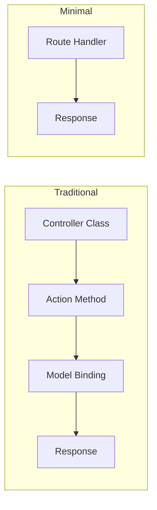
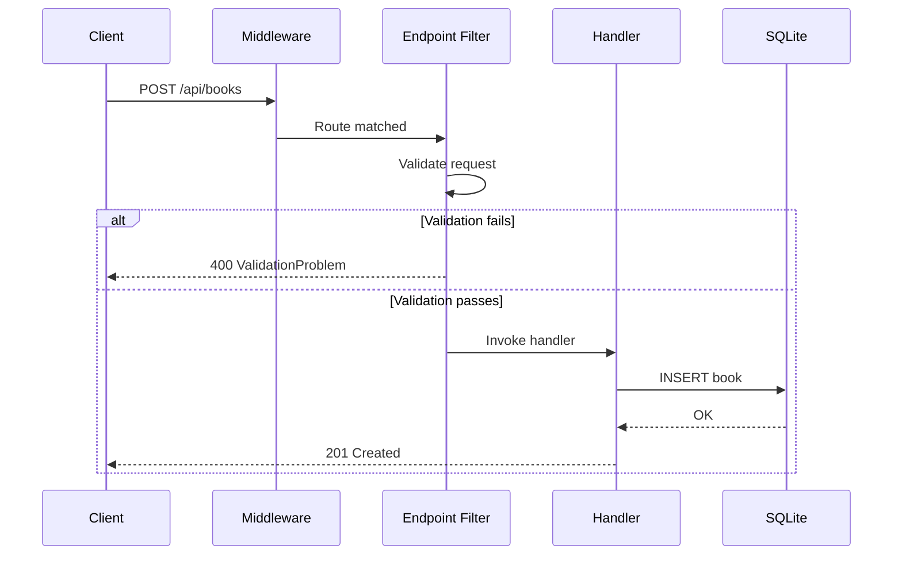

# Building REST APIs with Minimal APIs in .NET

Minimal APIs landed in .NET 6 and have matured into a first-class way to build HTTP services. If you've been reaching for full controllers out of habit, it's time to reconsider. Let's build a real API from scratch.

## Why Minimal APIs?

The traditional MVC controller approach works, but it comes with ceremony. Minimal APIs strip that away:



Less indirection. Same power. You get dependency injection, model binding, authentication, OpenAPI support --- all without the boilerplate.

## Project Setup

```bash
dotnet new web -n BookApi
cd BookApi
dotnet add package Microsoft.EntityFrameworkCore.Sqlite
dotnet add package Microsoft.AspNetCore.OpenApi
```

## Define the Domain

Start with a simple model and a DbContext:

```csharp
public record Book(int Id, string Title, string Author, int Year, string[] Tags);

public class BookDb : DbContext
{
    public BookDb(DbContextOptions<BookDb> options) : base(options) { }
    public DbSet<Book> Books => Set<Book>();
}
```

## Wire Up the Endpoints

Here's where Minimal APIs shine. Each endpoint is a single expression:

```csharp
var builder = WebApplication.CreateBuilder(args);
builder.Services.AddDbContext<BookDb>(opt =>
    opt.UseSqlite("Data Source=books.db"));

var app = builder.Build();

// GET all books, with optional tag filter
app.MapGet("/api/books", async (BookDb db, string? tag) =>
{
    var query = db.Books.AsQueryable();
    if (tag is not null)
        query = query.Where(b => b.Tags.Contains(tag));
    return await query.ToListAsync();
});

// GET a single book
app.MapGet("/api/books/{id}", async (int id, BookDb db) =>
    await db.Books.FindAsync(id)
        is Book book
            ? Results.Ok(book)
            : Results.NotFound());

// POST a new book
app.MapPost("/api/books", async (Book book, BookDb db) =>
{
    db.Books.Add(book);
    await db.SaveChangesAsync();
    return Results.Created($"/api/books/{book.Id}", book);
});

// DELETE a book
app.MapDelete("/api/books/{id}", async (int id, BookDb db) =>
{
    if (await db.Books.FindAsync(id) is not Book book)
        return Results.NotFound();

    db.Books.Remove(book);
    await db.SaveChangesAsync();
    return Results.NoContent();
});

app.Run();
```

## Adding Validation

Don't skip validation. Use endpoint filters for a clean approach:

```csharp
app.MapPost("/api/books", async (Book book, BookDb db) =>
{
    db.Books.Add(book);
    await db.SaveChangesAsync();
    return Results.Created($"/api/books/{book.Id}", book);
})
.AddEndpointFilter(async (context, next) =>
{
    var book = context.GetArgument<Book>(0);
    if (string.IsNullOrWhiteSpace(book.Title))
        return Results.ValidationProblem(
            new Dictionary<string, string[]>
            {
                ["title"] = ["Title is required"]
            });
    return await next(context);
});
```

## Request/Response Flow

Here's the full lifecycle of a request through our API:



## Organizing at Scale

As your API grows, group related endpoints:

```csharp
public static class BookEndpoints
{
    public static RouteGroupBuilder MapBookApi(this WebApplication app)
    {
        var group = app.MapGroup("/api/books")
            .WithTags("Books")
            .WithOpenApi();

        group.MapGet("/", GetAll);
        group.MapGet("/{id}", GetById);
        group.MapPost("/", Create);
        group.MapDelete("/{id}", Delete);

        return group;
    }

    private static async Task<IResult> GetAll(BookDb db, string? tag) { /* ... */ }
    private static async Task<IResult> GetById(int id, BookDb db) { /* ... */ }
    private static async Task<IResult> Create(Book book, BookDb db) { /* ... */ }
    private static async Task<IResult> Delete(int id, BookDb db) { /* ... */ }
}
```

Then in `Program.cs`:

```csharp
app.MapBookApi();
```

## Performance Comparison

Minimal APIs have measurable performance advantages due to less middleware overhead:

| Metric | Controllers | Minimal APIs |
|--------|------------|--------------|
| Requests/sec (simple GET) | ~180k | ~210k |
| Memory per request | ~2.1 KB | ~1.6 KB |
| Startup time | ~850ms | ~620ms |
| Lines of code (CRUD) | ~90 | ~45 |

*Benchmarks are approximate and depend on hardware and configuration.*

## Key Takeaways

1. **Start minimal** --- you can always add complexity later
2. **Use endpoint filters** for cross-cutting concerns like validation
3. **Group endpoints** as the API grows to maintain organization
4. **Leverage native DI** --- Minimal APIs have full DI support
5. **Don't forget OpenAPI** --- add `.WithOpenApi()` for automatic documentation

Minimal APIs aren't a toy. They're a production-ready approach that lets you focus on what matters: your domain logic.
