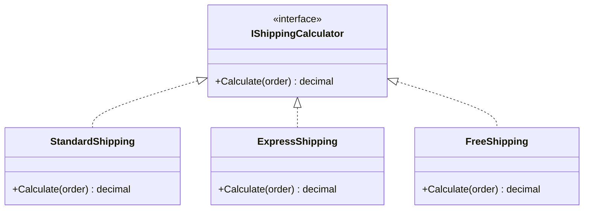
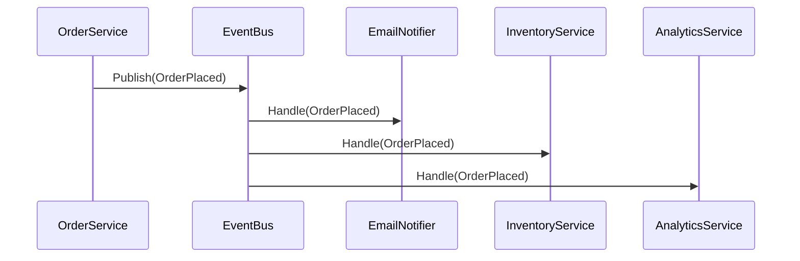
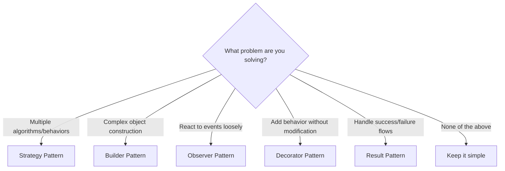

# Design Patterns You'll Actually Use

Design patterns get a bad reputation. Too often they're taught as abstract concepts with contrived examples. Let's look at the ones you'll genuinely reach for in modern C# --- and *when* to reach for them.

## The Strategy Pattern

**When to use:** You have multiple ways to do the same thing, and the choice depends on context.



```csharp
public interface IShippingCalculator
{
    decimal Calculate(Order order);
}

public class StandardShipping : IShippingCalculator
{
    public decimal Calculate(Order order) =>
        order.Weight * 0.5m + 4.99m;
}

public class ExpressShipping : IShippingCalculator
{
    public decimal Calculate(Order order) =>
        order.Weight * 1.2m + 12.99m;
}

// Register all strategies with DI
services.AddKeyedScoped<IShippingCalculator, StandardShipping>("standard");
services.AddKeyedScoped<IShippingCalculator, ExpressShipping>("express");
services.AddKeyedScoped<IShippingCalculator, FreeShipping>("free");
```

The beauty: adding a new shipping method means adding one class and one DI registration. Nothing else changes.

## The Builder Pattern

**When to use:** Object construction is complex, with many optional parameters.

```csharp
public class EmailBuilder
{
    private readonly Email _email = new();

    public EmailBuilder From(string address)
    {
        _email.From = address;
        return this;
    }

    public EmailBuilder To(string address)
    {
        _email.Recipients.Add(address);
        return this;
    }

    public EmailBuilder WithSubject(string subject)
    {
        _email.Subject = subject;
        return this;
    }

    public EmailBuilder WithBody(string body, bool isHtml = false)
    {
        _email.Body = body;
        _email.IsHtml = isHtml;
        return this;
    }

    public EmailBuilder WithAttachment(string path)
    {
        _email.Attachments.Add(path);
        return this;
    }

    public Email Build()
    {
        if (string.IsNullOrEmpty(_email.From))
            throw new InvalidOperationException("Sender is required");
        if (_email.Recipients.Count == 0)
            throw new InvalidOperationException("At least one recipient is required");
        return _email;
    }
}

// Usage --- reads like a sentence
var email = new EmailBuilder()
    .From("team@example.com")
    .To("user@example.com")
    .WithSubject("Welcome aboard!")
    .WithBody("<h1>Hello!</h1>", isHtml: true)
    .WithAttachment("/docs/guide.pdf")
    .Build();
```

## The Observer Pattern (via Events)

**When to use:** Multiple parts of your system need to react to something happening, without tight coupling.



In modern .NET, you'd typically use MediatR notifications or a simple event bus:

```csharp
public record OrderPlaced(Guid OrderId, string CustomerEmail, decimal Total);

public class OrderPlacedEmailHandler : INotificationHandler<OrderPlaced>
{
    private readonly IEmailService _email;

    public OrderPlacedEmailHandler(IEmailService email) => _email = email;

    public async Task Handle(OrderPlaced notification, CancellationToken ct)
    {
        await _email.SendAsync(
            notification.CustomerEmail,
            "Order Confirmed",
            $"Your order #{notification.OrderId} for {notification.Total:C} is confirmed.");
    }
}
```

Adding a new reaction to "order placed" means adding a new handler. The `OrderService` never knows or cares.

## The Decorator Pattern

**When to use:** You want to add behavior to an existing service without modifying it.


```csharp
// Base implementation
public class SqlProductRepository : IProductRepository
{
    public async Task<Product?> GetByIdAsync(int id) =>
        await _db.Products.FindAsync(id);
}

// Add caching --- without touching SqlProductRepository
public class CachingProductRepository : IProductRepository
{
    private readonly IProductRepository _inner;
    private readonly IMemoryCache _cache;

    public CachingProductRepository(IProductRepository inner, IMemoryCache cache)
    {
        _inner = inner;
        _cache = cache;
    }

    public async Task<Product?> GetByIdAsync(int id) =>
        await _cache.GetOrCreateAsync($"product:{id}",
            _ => _inner.GetByIdAsync(id));
}

// Register with DI
services.AddScoped<SqlProductRepository>();
services.AddScoped<IProductRepository>(sp =>
    new CachingProductRepository(
        sp.GetRequiredService<SqlProductRepository>(),
        sp.GetRequiredService<IMemoryCache>()));
```

## The Result Pattern

**When to use:** You want to handle success and failure without exceptions for expected cases.

```csharp
public class Result<T>
{
    public T? Value { get; }
    public string? Error { get; }
    public bool IsSuccess => Error is null;

    private Result(T value) => Value = value;
    private Result(string error) => Error = error;

    public static Result<T> Success(T value) => new(value);
    public static Result<T> Failure(string error) => new(error);

    public TOut Match<TOut>(Func<T, TOut> onSuccess, Func<string, TOut> onFailure) =>
        IsSuccess ? onSuccess(Value!) : onFailure(Error!);
}

// Usage
public Result<User> CreateUser(string email, string name)
{
    if (!IsValidEmail(email))
        return Result<User>.Failure("Invalid email address");

    if (_repository.ExistsByEmail(email))
        return Result<User>.Failure("Email already registered");

    var user = new User(email, name);
    _repository.Add(user);
    return Result<User>.Success(user);
}

// Caller handles both cases explicitly
var result = CreateUser("alice@example.com", "Alice");
return result.Match(
    user => Results.Created($"/users/{user.Id}", user),
    error => Results.BadRequest(error));
```

## When NOT to Use Patterns

Patterns are tools, not goals. Don't use them when:

| Situation | What to do instead |
|-----------|--------------------|
| Only one implementation exists | Use the concrete class directly |
| The "pattern" adds more code than it saves | Keep it simple |
| You're guessing about future needs | Wait until the need is real |
| A language feature does the same thing | Use the language feature |

> The best code is the simplest code that solves the problem. Patterns are for *managing complexity*, not *creating* it.

## Quick Reference



The right pattern is the one that makes your code clearer. If a pattern makes your code harder to follow, you're using the wrong one --- or you don't need one at all.
