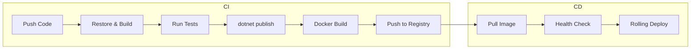

# Containerizing .NET Apps: From Dockerfile to Production

Containers have become the default deployment unit for modern applications. If you're building .NET apps and not containerizing them yet, here's everything you need to go from zero to production.

## Why Containers?

The pitch is simple: **build once, run anywhere**. But the real benefits go deeper:

- Consistent environments across dev, staging, and production
- Isolated dependencies --- no more "works on my machine"
- Horizontal scaling with orchestrators like Kubernetes
- Reproducible builds for your CI/CD pipeline

## The Multi-Stage Dockerfile

A naive Dockerfile copies everything and runs `dotnet publish`. A production Dockerfile uses multi-stage builds to keep the final image small:

```dockerfile
# Stage 1: Build
FROM mcr.microsoft.com/dotnet/sdk:9.0 AS build
WORKDIR /src

# Copy project files first (better caching)
COPY *.csproj .
RUN dotnet restore

# Copy everything else and publish
COPY . .
RUN dotnet publish -c Release -o /app --no-restore

# Stage 2: Runtime
FROM mcr.microsoft.com/dotnet/aspnet:9.0-alpine
WORKDIR /app
COPY --from=build /app .

# Run as non-root user
RUN addgroup -S appgroup && adduser -S appuser -G appgroup
USER appuser

EXPOSE 8080
ENTRYPOINT ["dotnet", "MyApp.dll"]
```

## Image Size Comparison

The multi-stage approach dramatically reduces image size:

| Approach | Image Size |
|----------|-----------|
| SDK image (naive) | ~900 MB |
| ASP.NET runtime image | ~220 MB |
| Alpine runtime image | ~110 MB |
| Alpine + trimmed publish | ~75 MB |

That's a **12x reduction** from the naive approach.

## The Build Pipeline

Here's how a typical CI/CD pipeline looks with containerized .NET:



## Docker Compose for Development

For local development, Docker Compose orchestrates your app alongside its dependencies:

```yaml
services:
  api:
    build: .
    ports:
      - "5000:8080"
    environment:
      - ConnectionStrings__Default=Host=db;Database=myapp;Username=postgres;Password=secret
    depends_on:
      db:
        condition: service_healthy

  db:
    image: postgres:16-alpine
    environment:
      POSTGRES_DB: myapp
      POSTGRES_USER: postgres
      POSTGRES_PASSWORD: secret
    volumes:
      - pgdata:/var/lib/postgresql/data
    healthcheck:
      test: ["CMD-SHELL", "pg_isready -U postgres"]
      interval: 5s
      timeout: 3s
      retries: 5

volumes:
  pgdata:
```

```bash
# One command to start everything
docker compose up -d

# View logs
docker compose logs -f api

# Tear down
docker compose down
```

## Health Checks

Always add health checks to your .NET app. They're critical for orchestrators:

```csharp
builder.Services.AddHealthChecks()
    .AddNpgSql(connectionString, name: "database")
    .AddCheck("self", () => HealthCheckResult.Healthy());

app.MapHealthChecks("/healthz", new HealthCheckOptions
{
    ResponseWriter = UIResponseWriter.WriteHealthCheckUIResponse
});
```

Then reference it in your Dockerfile:

```dockerfile
HEALTHCHECK --interval=30s --timeout=3s --retries=3 \
    CMD wget --no-verbose --tries=1 --spider http://localhost:8080/healthz || exit 1
```

## GitHub Actions Workflow

Automate the whole thing with GitHub Actions:

```yaml
name: Build and Deploy

on:
  push:
    branches: [main]

jobs:
  build:
    runs-on: ubuntu-latest
    steps:
      - uses: actions/checkout@v4

      - name: Build and push Docker image
        uses: docker/build-push-action@v5
        with:
          push: true
          tags: ghcr.io/${{ github.repository }}:latest
          cache-from: type=gha
          cache-to: type=gha,mode=max
```

## Production Checklist

Before deploying containers to production, verify:

- [ ] Multi-stage build to minimize image size
- [ ] Non-root user in the container
- [ ] Health checks configured
- [ ] Secrets passed via environment variables, not baked into the image
- [ ] Logging outputs to stdout/stderr (not files)
- [ ] Graceful shutdown handles `SIGTERM`
- [ ] Resource limits set (CPU and memory)
- [ ] Image scanning for vulnerabilities

## Key Takeaways

Containerizing .NET apps isn't just about writing a Dockerfile. It's about building a reproducible, secure, and efficient deployment pipeline. Start with the multi-stage Dockerfile, add health checks, and automate with CI/CD. Everything else follows.
