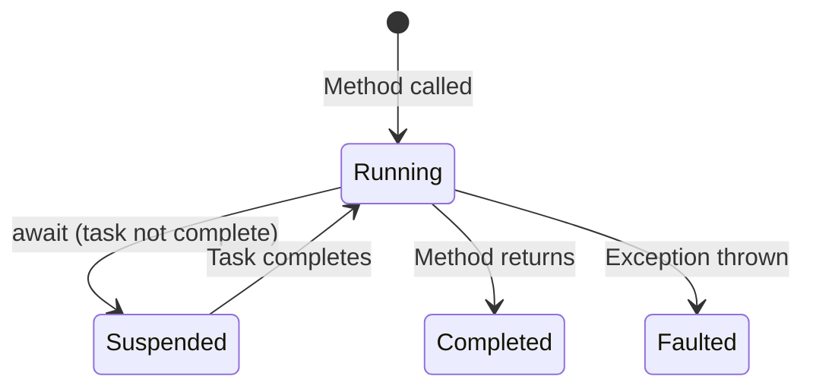

# Understanding Async/Await in C#: Beyond the Basics

Most C# developers use `async`/`await` daily. Fewer understand what happens underneath. Let's go beyond the surface and look at how it actually works, where it breaks, and how to use it well.

## What Async/Await Actually Does

When you write `await`, the compiler transforms your method into a **state machine**. Each `await` is a potential suspension point:



The method doesn't block a thread while waiting. Instead, it registers a continuation and *returns*. When the awaited task completes, the continuation resumes execution.

## The Compiler's State Machine

This innocent-looking method:

```csharp
public async Task<string> FetchDataAsync(string url)
{
    var client = new HttpClient();
    var response = await client.GetAsync(url);
    var content = await response.Content.ReadAsStringAsync();
    return content;
}
```

Gets transformed into roughly this:

```csharp
// Simplified compiler output (the real version is more complex)
private struct FetchDataAsyncStateMachine : IAsyncStateMachine
{
    public int State;
    public AsyncTaskMethodBuilder<string> Builder;
    public string Url;

    // Local variables become fields
    private HttpClient _client;
    private HttpResponseMessage _response;
    private string _content;

    public void MoveNext()
    {
        switch (State)
        {
            case 0:
                _client = new HttpClient();
                var task1 = _client.GetAsync(Url);
                State = 1;
                Builder.AwaitUnsafeOnCompleted(ref task1.GetAwaiter(), ref this);
                return;
            case 1:
                _response = /* result of task1 */;
                var task2 = _response.Content.ReadAsStringAsync();
                State = 2;
                Builder.AwaitUnsafeOnCompleted(ref task2.GetAwaiter(), ref this);
                return;
            case 2:
                _content = /* result of task2 */;
                Builder.SetResult(_content);
                return;
        }
    }
}
```

Each `await` becomes a state transition. The runtime manages the rest.

## Common Pitfalls

### 1. Async Void --- The Silent Killer

```csharp
// WRONG: exceptions here crash the process
public async void HandleClick(object sender, EventArgs e)
{
    await DoSomethingAsync(); // unobserved exception = crash
}

// RIGHT: return Task whenever possible
public async Task HandleClickAsync()
{
    await DoSomethingAsync();
}
```

`async void` methods can't be awaited and their exceptions can't be caught. The *only* valid use is event handlers in UI frameworks.

### 2. Blocking on Async Code

```csharp
// WRONG: can deadlock in UI/ASP.NET contexts
var result = GetDataAsync().Result;

// WRONG: same problem
var result = GetDataAsync().GetAwaiter().GetResult();

// RIGHT: async all the way
var result = await GetDataAsync();
```

### 3. Unnecessary Async

```csharp
// WRONG: adds overhead for no reason
public async Task<int> GetCountAsync()
{
    return await _repository.CountAsync();
}

// RIGHT: just return the task directly
public Task<int> GetCountAsync()
{
    return _repository.CountAsync();
}
```

Only use `async`/`await` when you need to *do something* with the result before returning, or when you need `try`/`catch`/`finally` around the await.

## Concurrent vs. Sequential

One of the biggest performance wins with async is running independent operations concurrently:

```csharp
// SEQUENTIAL: ~3 seconds total
var users = await GetUsersAsync();      // 1 sec
var orders = await GetOrdersAsync();    // 1 sec
var products = await GetProductsAsync(); // 1 sec

// CONCURRENT: ~1 second total
var usersTask = GetUsersAsync();
var ordersTask = GetOrdersAsync();
var productsTask = GetProductsAsync();

await Task.WhenAll(usersTask, ordersTask, productsTask);

var users = usersTask.Result;
var orders = ordersTask.Result;
var products = productsTask.Result;
```



```mermaid
gantt
    title Sequential vs Concurrent Execution
    dateFormat X
    axisFormat %s

    section Sequential
    GetUsers     :0, 1000
    GetOrders    :1000, 2000
    GetProducts  :2000, 3000

    section Concurrent
    GetUsers     :0, 1000
    GetOrders    :0, 1000
    GetProducts  :0, 1000
```

## Cancellation

Always support cancellation in async methods:

```csharp
public async Task<List<Product>> SearchAsync(
    string query,
    CancellationToken ct = default)
{
    var response = await _httpClient.GetAsync($"/search?q={query}", ct);
    response.EnsureSuccessStatusCode();

    return await response.Content
        .ReadFromJsonAsync<List<Product>>(ct)
        ?? [];
}

// Usage with timeout
using var cts = new CancellationTokenSource(TimeSpan.FromSeconds(5));
try
{
    var results = await SearchAsync("widgets", cts.Token);
}
catch (OperationCanceledException)
{
    // Handle timeout or cancellation
}
```

## ValueTask for Hot Paths

If a method *often* completes synchronously (e.g., cache hits), use `ValueTask<T>` to avoid allocating a `Task` object:

```csharp
public ValueTask<Product?> GetByIdAsync(int id)
{
    // Cache hit: returns synchronously, no allocation
    if (_cache.TryGetValue(id, out Product? cached))
        return new ValueTask<Product?>(cached);

    // Cache miss: falls back to async
    return new ValueTask<Product?>(LoadFromDbAsync(id));
}
```

{{alert:warning}}Only use `ValueTask` when profiling shows `Task` allocation is a bottleneck. For most code, `Task` is fine.{{/alert}}

## Quick Reference

| Pattern | When to Use |
|---------|-------------|
| `Task.WhenAll` | Multiple independent async operations |
| `Task.WhenAny` | First-one-wins scenarios, timeouts |
| `CancellationToken` | Every async method that does I/O |
| `ValueTask<T>` | Hot paths with frequent sync completion |
| `ConfigureAwait(false)` | Library code that doesn't need the sync context |
| `IAsyncEnumerable<T>` | Streaming results one at a time |

## The Golden Rules

1. **Async all the way** --- don't mix sync and async
2. **Never use `async void`** except for event handlers
3. **Always pass `CancellationToken`** for I/O operations
4. **Run independent tasks concurrently** with `Task.WhenAll`
5. **Don't add `async`** if you're just returning a task

Async/await is one of C#'s best features. Use it correctly, and your applications will be responsive, scalable, and efficient.
