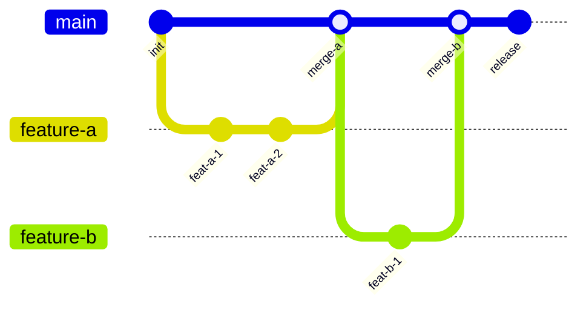
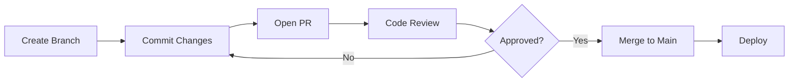
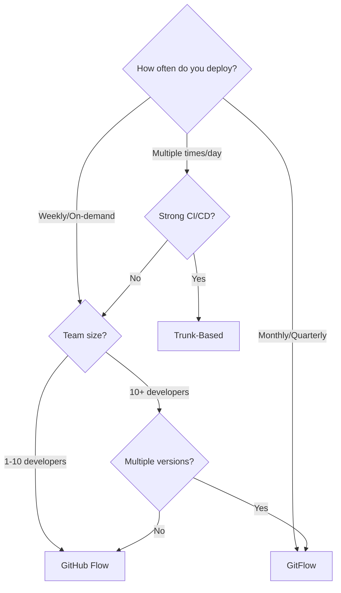

# A Practical Guide to Git Branching Strategies

Every team argues about Git branching at some point. The truth is there's no single best strategy --- it depends on your team size, release cadence, and deployment model. Let's compare the three most common approaches.

## The Three Models



### 1. Trunk-Based Development

The simplest model. Everyone commits to `main` (the trunk), either directly or via very short-lived branches (< 1 day).

**How it works:**
- Developers commit to `main` multiple times per day
- Feature flags hide incomplete work
- CI runs on every commit
- Deployment is continuous

**Best for:** Teams with strong CI/CD, continuous deployment, and experienced developers.

### 2. GitHub Flow

One step up from trunk-based. Work happens on feature branches, merged via pull requests.

**How it works:**
- Create a branch from `main`
- Make commits, push, open a PR
- Team reviews and approves
- Merge to `main`, deploy



**Best for:** Most teams. Simple enough to learn quickly, structured enough to catch issues.

### 3. GitFlow

The most structured model. Uses dedicated branches for features, releases, and hotfixes.

**How it works:**
- `main` holds production code
- `develop` is the integration branch
- Feature branches merge into `develop`
- Release branches fork from `develop` for stabilization
- Hotfix branches fork from `main` for urgent fixes

**Best for:** Teams with scheduled releases, long QA cycles, or multiple versions in production.

## Comparison

| Criteria | Trunk-Based | GitHub Flow | GitFlow |
|----------|------------|-------------|---------|
| Complexity | Low | Low | High |
| Merge conflicts | Rare | Occasional | Frequent |
| Release cadence | Continuous | On-demand | Scheduled |
| Team size | Any | Small--Medium | Medium--Large |
| CI/CD required | Essential | Recommended | Optional |
| Feature flags needed | Yes | Sometimes | No |
| Learning curve | Minimal | Minimal | Significant |

## Branch Naming Conventions

Regardless of strategy, consistent naming helps:

```
feature/add-user-auth
bugfix/fix-login-redirect
hotfix/patch-payment-timeout
release/v2.1.0
chore/update-dependencies
docs/api-reference
```

## The Decision Tree



## Pull Request Best Practices

Whichever model you choose, good PRs make it work:

1. **Keep PRs small** --- under 400 lines changed
2. **Write descriptive titles** --- "Add email validation to signup form", not "Fix stuff"
3. **Include context** --- explain *why*, not just *what*
4. **Add a test plan** --- how should reviewers verify this works?
5. **Request specific reviewers** --- don't rely on drive-by reviews

## Handling Long-Running Branches

Sometimes you can't avoid a branch that lives for weeks (large refactors, major features). Minimize pain:

- **Rebase frequently** from `main` to stay current
- **Break the work into smaller PRs** that merge incrementally
- **Use feature flags** to merge incomplete code safely
- **Communicate** --- let the team know the branch exists and what it touches

## My Recommendation

For most teams, **GitHub Flow** is the sweet spot:

- Simple enough that everyone understands it on day one
- Pull requests provide natural code review checkpoints
- Works with any deployment frequency
- Scales from solo projects to mid-size teams

Start there. Move to trunk-based if you outgrow it. Move to GitFlow only if your release process truly demands it.

> The best branching strategy is the simplest one your team will actually follow consistently.
