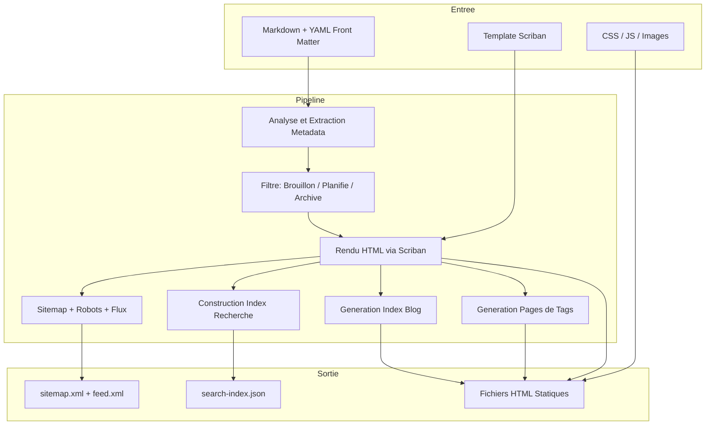

# A propos de StaticWGen

StaticWGen est un generateur de sites statiques construit entierement sur l'ecosysteme .NET. Il a ete cree pour prouver qu'il n'est pas necessaire d'utiliser une toolchain JavaScript pour construire des sites statiques modernes et riches en fonctionnalites.

## Architecture

Le pipeline de build est orchestre par NUKE et suit une conception composable :

## Extensions Markdown

StaticWGen utilise Markdig avec un ensemble d'extensions soigneusement choisies :

- **YAML Front Matter** --- titre, description, auteur, date, tags et metadonnees personnalisees
- **Coloration Syntaxique** --- 200+ langages via Prism.js
- **Diagrammes Mermaid** --- organigrammes, diagrammes de sequence, machines d'etat
- **Mathematiques LaTeX** --- en ligne \( E = mc^2 \) et en mode affichage
- **Emoji** --- ecrivez `:rocket:` et obtenez :rocket:
- **SmartyPants** --- guillemets et tirets typographiques
- **Tableaux, Notes de Bas de Page, Listes de Taches**

## Cycle de Vie du Contenu

| Statut | Comportement |
|--------|-------------|
| **Publie** | Visible sur le site, inclus dans les flux et la recherche |
| **Brouillon** | Cache sauf si construit avec `--include-drafts` |
| **Planifie** | Auto-publication quand la `publishDate` arrive |
| **Archive** | Accessible par URL mais exclu de la navigation |

## Philosophie

1. **Le contenu d'abord** --- le Markdown est la source de verite
2. **Pas de magie** --- chaque etape est du code C# explicite
3. **Dependances minimales** --- Pico CSS + JS vanilla, pas de framework
4. **Deployer partout** --- Docker, GitHub Pages, S3, ou `cp -r output/ /var/www`
