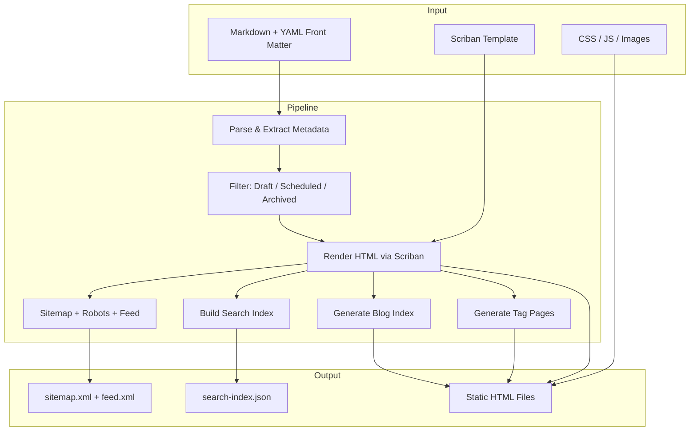

# About StaticWGen

StaticWGen is a static website generator built entirely on the .NET stack. It was created to prove that you don't need a JavaScript toolchain to build modern, feature-rich static websites.

## Architecture

The build pipeline is orchestrated by NUKE and follows a clear, composable design:



## The Build System

Each step in the pipeline is a composable NUKE interface. This means you can extend or override any part independently:

```csharp
// Each pipeline step is a composable interface
public interface IGenerateWebsite : INukeBuild
{
    Target GenerateHtml => _ => _
        .Executes(() =>
        {
            // Parse Markdown, apply templates, write HTML
        });
}

public interface IGenerateTagPages : INukeBuild
{
    Target GenerateTagPages => _ => _
        .TriggeredBy<IGenerateWebsite>(x => x.GenerateHtml)
        .Executes(() =>
        {
            // Extract tags, generate per-tag pages
        });
}
```

## Markdown Extensions

StaticWGen uses Markdig with a carefully chosen set of extensions:

- **YAML Front Matter** --- title, description, author, date, tags, and custom metadata
- **Syntax Highlighting** --- 200+ languages powered by Prism.js
- **Mermaid Diagrams** --- flowcharts, sequence diagrams, state machines, and more
- **LaTeX Mathematics** --- both inline \( E = mc^2 \) and display mode
- **Emoji** --- write `:rocket:` and get :rocket:
- **SmartyPants** --- proper typographic quotes and dashes
- **Tables, Footnotes, Task Lists** --- all the essentials

## Content Lifecycle

Every piece of content goes through a lifecycle:

| Status | Behavior |
|--------|----------|
| **Published** | Visible on the site, included in feeds and search |
| **Draft** | Hidden unless built with `--include-drafts` |
| **Scheduled** | Auto-publishes when `publishDate` arrives |
| **Archived** | Accessible by URL but excluded from navigation |

## SEO & Discoverability

Generated pages include everything modern search engines expect:

- Canonical URLs and Open Graph metadata
- Twitter Card tags for rich social previews
- JSON-LD structured data (Article / BlogPosting schema)
- XML Sitemap for crawlers
- Atom feed for RSS readers
- Hreflang links for multilingual content

## Philosophy

1. **Content first** --- Markdown is the source of truth
2. **No magic** --- every build step is explicit C# code
3. **Minimal dependencies** --- Pico CSS + vanilla JS, no frameworks
4. **Deploy anywhere** --- Docker, GitHub Pages, S3, or `cp -r output/ /var/www`
