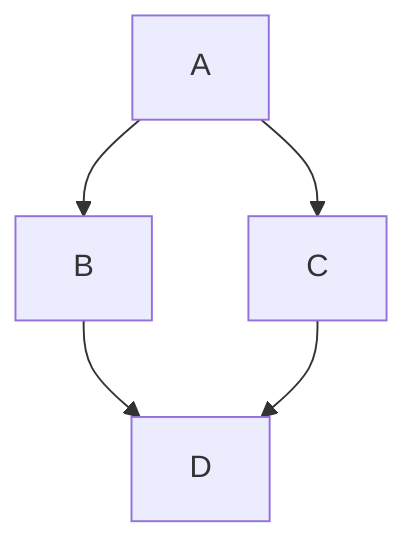

# About This Demo

Welcome to the demo website! This site is generated using **Nuke**, a powerful build automation tool, and **Pico CSS**
for styling.

## What is Nuke?

Nuke is a cross-platform build automation system that helps manage complex build pipelines. With Nuke, you can automate
tasks like:

- Building your projects
- Running tests
- Generating static websites (like this one)
- Packaging and deploying applications


## Why Pico CSS?

[Pico CSS](https://picocss.com) is a lightweight, minimalist CSS framework. It offers a great balance between simplicity
and elegance, making it easy to style static websites without writing extensive CSS code.

## Parsing Markdown Files

This demo uses the `Markdig` library to parse Markdown files. This allows you to write content in Markdown format
and have some nice extensions like `Mermaid` diagrams or `Emoji` support. ;)



## Support for Prism.js

This demo also includes support for syntax highlighting using `Prism.js`. You can easily add code blocks to your Markdown
files and have them automatically highlighted.

```csharp
public class HelloWorld
{
    public static void Main()
    {
        Console.WriteLine("Hello, World!");
    }
}
```

## Features of This Demo

- Static site generation from Markdown files
- Automated build process with Nuke
- Simple styling using Pico CSS
- Docker containerization for local deployment
