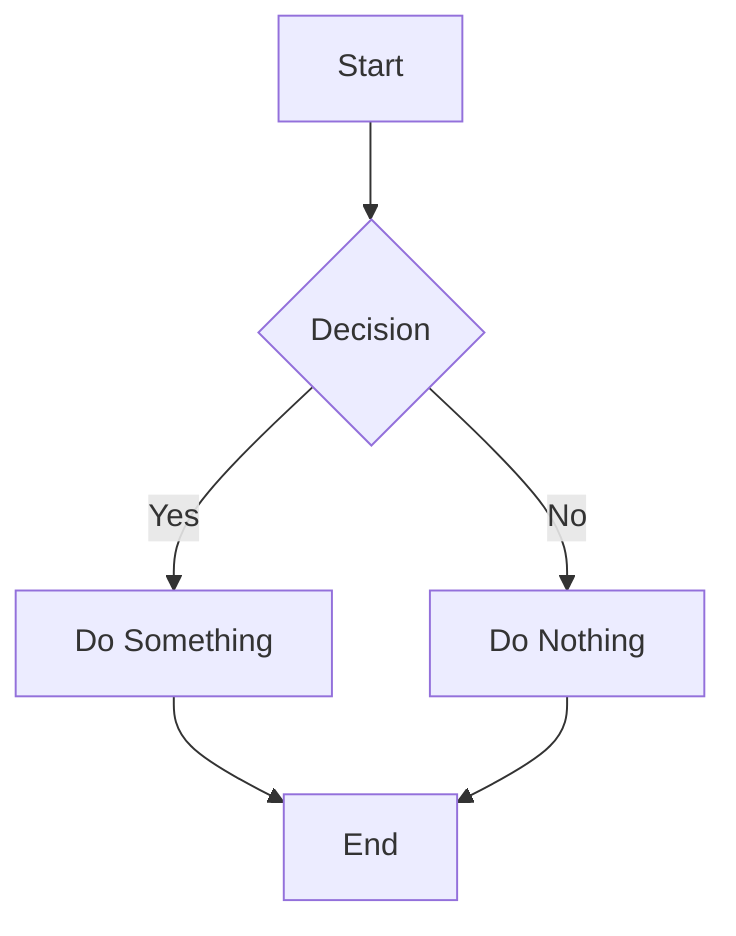
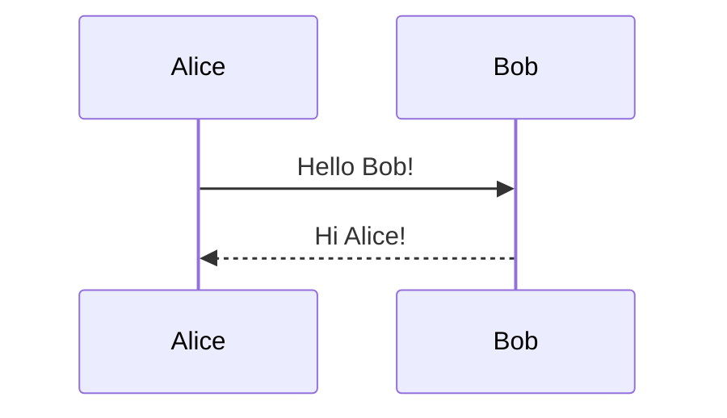

# Extensions Test

This page tests all four Markdig extensions working simultaneously.

## Emoji

Hello :wave: this is a test with emoji :smile: and :rocket: support!

## Mathematics

Inline math: \( E = mc^2 \) and \( \sum_{i=1}^{n} i = \frac{n(n+1)}{2} \).

Display math:

\[
T(n) = cT(n - 1) + b n^k
\]

## Prism Syntax Highlighting

```csharp
public class HelloWorld
{
    public static void Main(string[] args)
    {
        Console.WriteLine("Hello, World!");
    }
}
```

```python
def fibonacci(n):
    if n <= 1:
        return n
    return fibonacci(n - 1) + fibonacci(n - 2)
```

## Mermaid Diagrams



## All Together

Here we use :sparkles: emoji, math \( x^2 + y^2 = r^2 \), and code:

```javascript
const greeting = "Hello!";
console.log(greeting);
```

And a mermaid diagram:



Everything should render correctly! :tada:

## Plugin Shortcodes

### YouTube Embed

{{youtube:dQw4w9WgXcQ}}

### Alert Boxes

{{alert:info}}This is an informational message.{{/alert}}

{{alert:warning}}Be careful with this operation!{{/alert}}

{{alert:success}}The operation completed successfully.{{/alert}}

{{alert:danger}}This action cannot be undone!{{/alert}}
