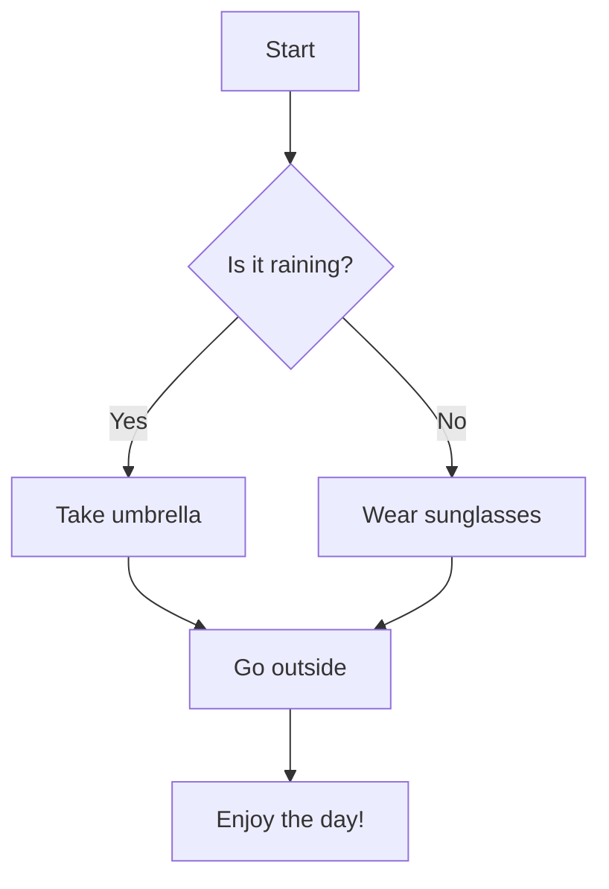
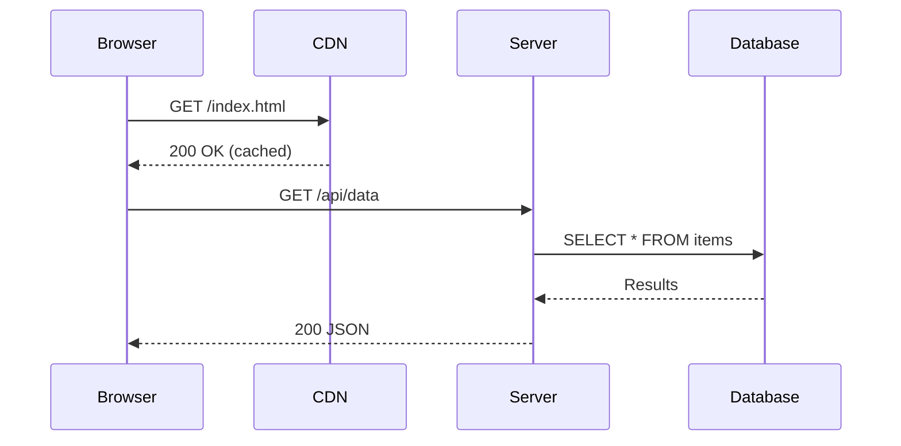
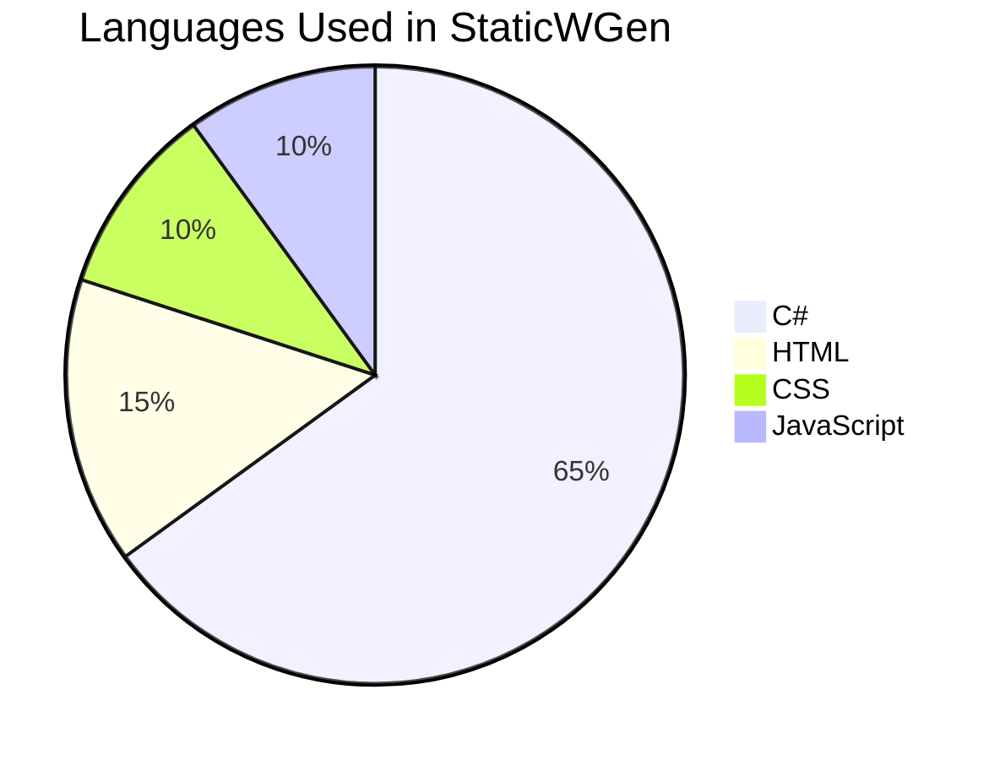
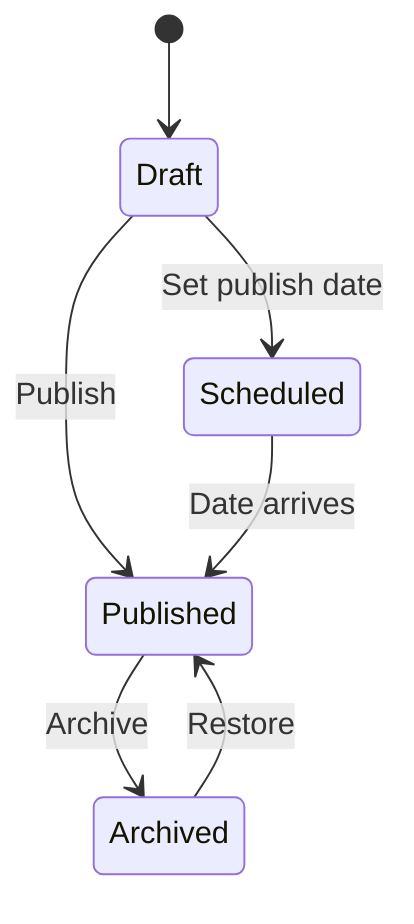

# Features Showcase

This page is a live demo of everything StaticWGen can render. Use it as a reference when writing your own content.

---

## Syntax Highlighting

Powered by Prism.js with support for 200+ languages.

### C#

```csharp
public record WeatherForecast(
    DateOnly Date,
    int TemperatureC,
    string? Summary)
{
    public int TemperatureF => 32 + (int)(TemperatureC / 0.5556);
}
```

### Python

```python
from dataclasses import dataclass

@dataclass
class Point:
    x: float
    y: float

    def distance_to(self, other: "Point") -> float:
        return ((self.x - other.x) ** 2 + (self.y - other.y) ** 2) ** 0.5
```

### TypeScript

```typescript
interface User {
  id: string;
  name: string;
  email: string;
  roles: ReadonlyArray<"admin" | "editor" | "viewer">;
}

const greet = (user: User): string =>
  `Hello, ${user.name}! You have ${user.roles.length} role(s).`;
```

### Bash

```bash
#!/bin/bash
for file in input/*.md; do
    echo "Processing: $file"
    name=$(basename "$file" .md)
    pandoc "$file" -o "output/${name}.html"
done
echo "Done! Generated $(ls output/*.html | wc -l) pages."
```

### SQL

```sql
SELECT
    u.name,
    COUNT(o.id) AS order_count,
    SUM(o.total) AS total_spent
FROM users u
LEFT JOIN orders o ON o.user_id = u.id
WHERE u.created_at >= '2024-01-01'
GROUP BY u.name
HAVING COUNT(o.id) > 5
ORDER BY total_spent DESC
LIMIT 10;
```

---

## Mermaid Diagrams

### Flowchart



### Sequence Diagram



### Pie Chart



### State Diagram



---

## Mathematics

Powered by KaTeX/MathJax rendering from LaTeX syntax.

### Inline Math

The quadratic formula is $x = \frac{-b \pm \sqrt{b^2 - 4ac}}{2a}$, which gives the roots of $ax^2 + bx + c = 0$.

Euler's identity $e^{i\pi} + 1 = 0$ connects five fundamental constants.

### Display Math

The Gaussian integral:

$$
\int_{-\infty}^{\infty} e^{-x^2} \, dx = \sqrt{\pi}
$$

Bayes' theorem:

$$
P(A|B) = \frac{P(B|A) \cdot P(A)}{P(B)}
$$

A matrix:

$$
\mathbf{A} = \begin{pmatrix} 1 & 2 & 3 \\ 4 & 5 & 6 \\ 7 & 8 & 9 \end{pmatrix}
$$

---

## Emoji

StaticWGen supports GitHub-style emoji shortcodes:

- :wave: Hello there!
- :rocket: Launching soon
- :bug: Bug report
- :white_check_mark: Tests passing
- :warning: Proceed with caution
- :sparkles: New feature
- :tada: Celebration time!
- :heart: Made with love

---

## Shortcodes

### YouTube Embed

{{youtube:dQw4w9WgXcQ}}

### Alert Boxes

{{alert:info}}This is an **informational** message. Use it for tips and notes.{{/alert}}

{{alert:success}}Operation completed **successfully**. Everything is working as expected.{{/alert}}

{{alert:warning}}**Warning:** this action may have unintended side effects. Proceed carefully.{{/alert}}

{{alert:danger}}**Error:** this action cannot be undone. Make sure you have a backup.{{/alert}}

---

## Tables

| Language | Paradigm | Typing | Year |
|----------|----------|--------|------|
| C# | Multi-paradigm | Static, strong | 2000 |
| Python | Multi-paradigm | Dynamic, strong | 1991 |
| Rust | Systems | Static, strong | 2010 |
| Go | Procedural | Static, strong | 2009 |
| TypeScript | Multi-paradigm | Static, structural | 2012 |

---

## Blockquotes

> The best code is the code you don't have to write.
> --- *Unknown*

> Design is not just what it looks like and feels like. Design is how it works.
> --- *Steve Jobs*

---

## Task Lists

- [x] Markdown parsing
- [x] Syntax highlighting
- [x] Mermaid diagrams
- [x] LaTeX math support
- [x] Emoji rendering
- [x] Alert shortcodes
- [x] YouTube embeds
- [ ] Custom themes (coming soon)
- [ ] Plugin system (planned)

---

## Footnotes

StaticWGen uses Markdig[^1] for Markdown parsing, which supports CommonMark[^2] and many extensions.

[^1]: [Markdig](https://github.com/xoofx/markdig) is a fast, powerful, CommonMark compliant Markdown processor for .NET.
[^2]: [CommonMark](https://commonmark.org/) is a strongly defined, highly compatible specification of Markdown.

---

This page renders every feature. If it looks good here, it'll look good in your content too.
