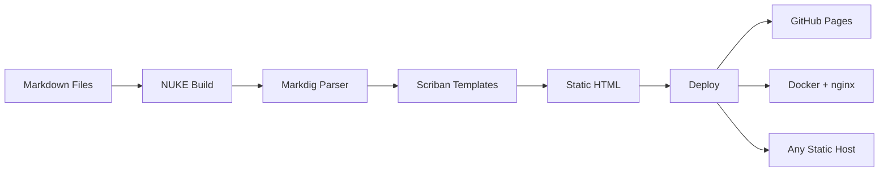

# Your Content, Beautifully Rendered

StaticWGen transforms Markdown into fast, elegant static websites. Built on the .NET ecosystem with NUKE build automation and Markdig parsing, it gives you everything you need --- and nothing you don't.


## Why StaticWGen?

Static sites are fast, secure, and easy to deploy. But most generators force you into JavaScript ecosystems or rigid conventions. StaticWGen takes a different approach:

- **Write in Markdown** --- focus on content, not configuration
- **Built on .NET** --- leverage the ecosystem you already know
- **Deploy anywhere** --- Docker, GitHub Pages, or any static host
- **Zero JavaScript frameworks** --- just clean HTML + Pico CSS

## Get Started in Seconds

```bash
# Clone the repository
git clone https://github.com/Atypical-Consulting/StaticWGen.git

# Generate the site
nuke

# That's it. Your site is in /output.
```

## Features at a Glance

| Feature | Description |
|---------|-------------|
| Markdown to HTML | Full CommonMark + extensions |
| Syntax Highlighting | 200+ languages via Prism.js |
| Mermaid Diagrams | Flowcharts, sequences, and more |
| LaTeX Mathematics | Inline and display equations |
| Blog & Tags | Paginated blog index with tag system |
| Full-Text Search | Client-side search, no server needed |
| SEO Optimized | Open Graph, JSON-LD, sitemaps, feeds |
| Dark Mode | Auto, light, and dark themes |
| Multi-Language | Built-in i18n with hreflang support |
| Docker Ready | One command to containerize and deploy |

## How It Works



## Built With

- **[NUKE](https://nuke.build)** --- cross-platform C# build automation
- **[Markdig](https://github.com/xoofx/markdig)** --- fast, extensible Markdown parser
- **[Pico CSS](https://picocss.com)** --- minimal, semantic CSS framework
- **[Prism.js](https://prismjs.com)** --- lightweight syntax highlighting
- **[Mermaid](https://mermaid.js.org)** --- diagrams from text

> StaticWGen is open source and MIT licensed. Contributions are welcome!
